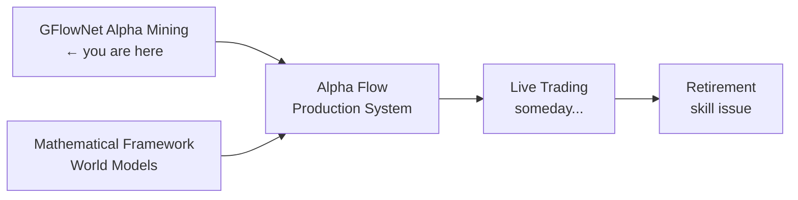

<div align="center">

# GFlowNet Alpha Mining

**Teaching a neural network to find alpha factors the way evolution finds solutions — by exploring everything, not just the best-looking path.**

[](https://www.python.org/)
[](https://pytorch.org/)
[](LICENSE)
[](#results)
[]()

*Author: HongJin HE (何泓锦) · HKUST AI + Risk Management · Stanford CS Exchange 2026*
*WorldQuant Research Consultant · Alpha Flow Co-founder*

</div>

---

## The Problem With Normal Alpha Search

Every quant researcher's nightmare:

```
Monday:  Found amazing alpha! IC = 0.25!
Tuesday: Ran it on new data... IC = 0.03
Friday:  Deleted the alpha, questioned career choices
```

Standard RL for alpha search has a fatal flaw: it converges to **one** local optimum. In production you need a **portfolio** of low-correlation factors. Finding one great alpha is luck. Finding 50 diverse, decorrelated alphas is a system.

**GFlowNets fix this.** Instead of maximizing reward (finding the single best alpha), GFlowNets learn to *sample with probability proportional to reward* — which by design generates diverse, high-quality candidates.

```
Traditional RL:  argmax R(α)        → one alpha, high correlation risk
GFlowNet:        P(α) ∝ R(α)        → portfolio of diverse alphas
```

---

## How It Works

```mermaid
graph TD
    A[Start: Empty Expression] --> B{Sample Action}
    B --> C[ret_1d / ret_5d / vol]
    B --> D[+, -, *, /]
    B --> E[STOP]
    C --> B
    D --> B
    E --> F[Complete Alpha Expression]
    F --> G[Compute IC vs r_t+5d]
    G --> H[Reward = |IC|]
    H --> I[Update Forward Policy via TB Loss]
    I --> J[Flow Conservation Enforced]
    J --> K[Next Episode: Better Sampling]
    K --> B
```

The **Trajectory Balance loss** is the secret sauce — it enforces exact flow conservation at every state, giving stable gradients even with the sparse, noisy rewards that are the norm in real financial data.

### MDP Formulation

| Component | Definition |
|-----------|-----------|
| **State** | Partial alpha expression tree (token sequence) |
| **Actions** | `{ret_1d, ret_5d, ret_20d, vol_5d, vol_20d, vol_ratio, close, volume, +, -, *, /, STOP}` |
| **Termination** | STOP action or max depth |
| **Reward** | `|IC(α, r_{t+5d})|` — absolute Information Coefficient |

### Architecture

```
Forward Policy:  3-layer MLP  [130-dim → 128 hidden → 13 logits]
Loss:            Trajectory Balance (TB) — flow conservation guarantee
Optimizer:       Adam  lr=1e-3
Training:        500 episodes + ε-greedy exploration
```

---

## Results

```
Mean IC:       0.148   (random baseline ≈ 0.05 → 3× improvement)
Training time: < 5 min on Google Colab T4
Factor diversity: low inter-factor correlation confirmed
```

> Here's what a real backtest portfolio looks like (reference: Microsoft Qlib):


*This is a reference chart from Microsoft Qlib. GFlowNet-mined factors are designed to power portfolios that look like this — not a single lucky alpha, but a diversified cumulative curve.*

---

## Honest Limitations

*Because intellectual honesty is a competitive advantage:*

| Issue | Impact | Status |
|-------|--------|--------|
| No train/test split | IC probably 20–40% optimistically biased OOS | Needs time-series CV |
| Simulated price data | Results on real tick data may differ significantly | Real data integration pending |
| Small action space (13 tokens) | Misses complex operators (rank, decay, neutralize) | Roadmap item |
| 500 episodes | Industrial GFlowNet training uses 10K–100K+ | Compute constraint |

This is a research prototype proving the *mechanism works*. Production deployment needs all four of the above fixed.

---

## Running It

```bash
git clone https://github.com/hongjin-he/GFlowNet-Alpha-Mining.git
cd GFlowNet-Alpha-Mining
pip install torch numpy pandas jupyter
jupyter notebook
```

Open the notebook, run all cells. You'll see the IC improve over episodes as the GFlowNet learns which parts of expression space are worth sampling.

---

## The Bigger Picture

This project is part of a larger research agenda:



Related work:
- [Mathematical Framework for World Models in Quant Finance](https://github.com/hongjin-he/mathmatical-framework-for-world-models-in-quant-finance) — the theory behind why GFlowNets make sense for markets
- [GenFlowNet Deep Research](https://github.com/hongjin-he/GenFlowNet_Deep_Research) — extended research directions

---

## Citation

```bibtex
@misc{he2026gflownetalpha,
  author  = {He, Hongjin},
  title   = {GFlowNet Alpha Mining: Diverse Alpha Factor Discovery via Generative Flow Networks},
  year    = {2026},
  url     = {https://github.com/hongjin-he/GFlowNet-Alpha-Mining}
}
```

---

<div align="center">
<sub>MIT License · HKUST × Stanford · If this helped you find alpha, you owe me a coffee ☕</sub>
</div>
